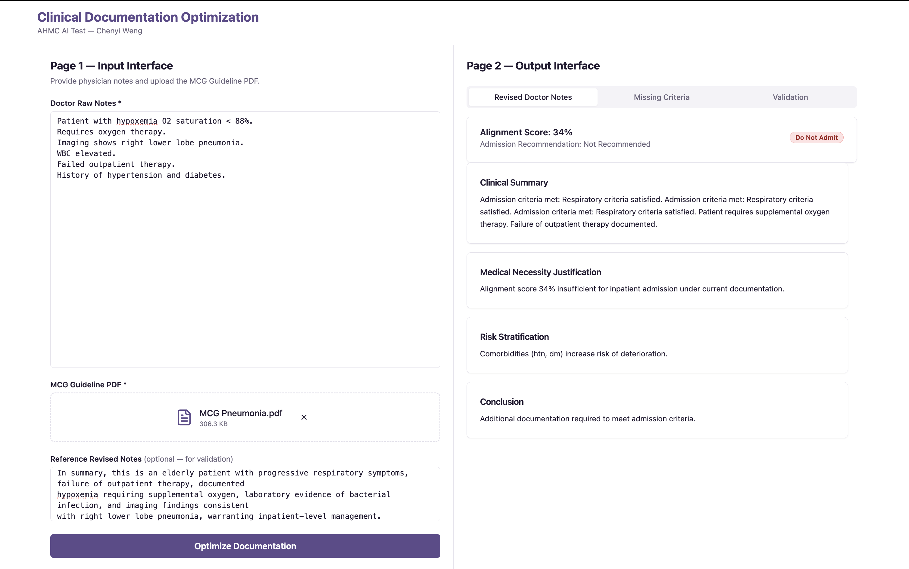
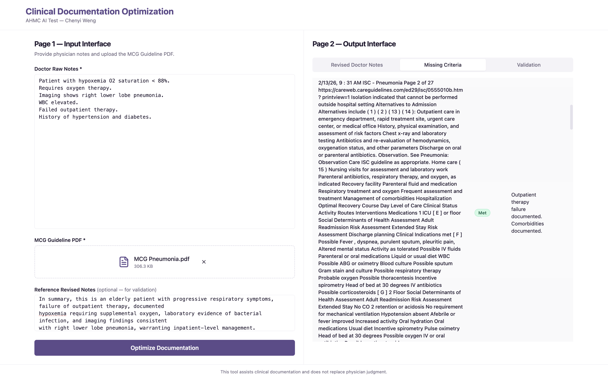
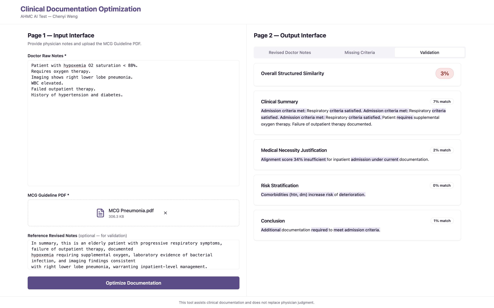

# Clinical Documentation Optimization System

<p align="left">
  <strong> 👩🏻‍💻 Chenyi Weng</strong><br/>
  Full-Stack Engineer · TypeScript · Clinical Rule Engine Architecture
</p>

---

A deterministic web-based system that aligns physician documentation with structured MCG Admission Guideline criteria using a rule-based engine. No generative AI or LLM APIs are used.


## Project Overview

This system implements a two-page clinical workflow that accepts raw physician notes and an MCG Guideline PDF, extracts structured admission criteria, performs deterministic criteria matching, and generates optimized documentation with an admission alignment score. It supports validation comparison against reference documentation and operates entirely through predefined rules and structured logic.

## Core Architecture

- Frontend: React + TypeScript + TailwindCSS + pdfjs-dist
- Backend: Node.js + Express + TypeScript
- Processing: Deterministic Rule Engine (no LLM/AI APIs)
- Data flow: Linear pipeline through discrete, stateless components

## Two-Page Workflow

#### Application Preview
🔹 Main Workflow
<p align="center">
  
</p>

🔹 Missing Criteria Evaluation
<p align="center">
  
</p>

🔹 Validation Mode
<p align="center">
  
</p>

### Page 1 – Input Interface
Required inputs:
- Doctor Raw Notes (text)
- MCG Guideline PDF (upload, PDF only)

Optional:
- Reference Revised Notes (enables validation mode)

Features include drag-and-drop PDF support, file validation, error handling, and step indicators for parsing guidelines, extracting clinical data, matching criteria, and generating output.

### Page 2 – Output Interface
Produces two structured outputs:
1) Revised Doctor Notes with sections: Clinical Summary, Medical Necessity Justification, Risk Stratification, Conclusion
2) Missing Criteria Table with columns: Criteria, Status (Met/Partially Met/Missing), Evidence Found, Suggested Language

## Deterministic Rule Engine

The engine processes inputs through six orchestrated components:
1) PDF Section Parser (`parsePdfSections`) parses PDF text into structured sections
2) Criteria Extractor (`extractCriteria`) identifies and categorizes admission criteria using keyword patterns
3) Clinical Data Extractor (`extractClinicalData`) parses physician notes into structured clinical signals
4) Criteria Evaluator (`evaluateCriteria`) matches criteria against clinical data using rule matrices
5) Admission Scorer (`computeAdmissionDecision`) calculates weighted scores and applies a 60% admission threshold
6) Justification Builder (`buildJustification`) generates structured revised documentation

The orchestration function `runAlignmentEngine` executes these steps sequentially and aggregates results into an `AlignmentResult` object.

## Validation Mode

When reference notes are provided (Case 1), the system performs structured section parsing and computes section-by-section similarity scores with word-level difference highlighting across Clinical Summary, Medical Necessity Justification, Risk Stratification, and Conclusion. An overall structured similarity percentage is displayed.

## Example Scenarios

### Case 1 – Validation Mode
Inputs: Doctor Raw Notes, MCG Guideline PDF, Reference Revised Notes
Outputs: Revised Doctor Notes, Missing Criteria Table, Structured Similarity Score

### Case 2 – Optimization Mode
Inputs: Doctor Raw Notes, MCG Guideline PDF
Outputs: Revised Doctor Notes, Missing Criteria Table, Admission Recommendation

## Getting Started

### Backend
```bash
cd server
npm install
npm run dev
# Server runs at http://localhost:5050
```

### Frontend
```bash
npm install
npm run dev
# Frontend runs at http://localhost:8081
```

## Project Structure

```
/
├── server/
│   ├── engine/
│   │   ├── alignmentEngine.ts      # Orchestrates the full pipeline
│   │   ├── criteriaExtractor.ts    # Extracts and categorizes criteria
│   │   ├── types.ts                # Core type definitions
│   │   ├── admissionScorer.ts      # Scoring and admission decision
│   │   └── justificationBuilder.ts # Generates revised notes
│   └── index.ts                    # Express API entry point
├── src/
│   ├── components/
│   │   ├── ValidationComparison.tsx # Validation mode UI
│   │   └── ...
│   └── ...
└── README.md
```

## Security & Design Philosophy

- No persistent storage; all processing is session-based
- No external AI APIs; fully deterministic logic
- Stateless components with no side effects
- Auditability: every decision traces to specific rules
- Reproducibility: identical inputs produce identical outputs
- Clinical defensibility: results explained with precise logic

## Disclaimer

This tool assists clinical documentation and does not replace physician judgment.

## Notes

The admission threshold is set at 60%: `percentage >= 60% → Admit`. Criteria are categorized as Respiratory, Imaging, Laboratory, Outpatient, Comorbidity, or General based on keyword patterns. The engine uses a weighted scoring model where each criterion contributes up to 5 points; "Met" criteria contribute full weight, "Partially Met" contribute partial weight, and "Missing" contribute zero. The `AlignmentResult` aggregates extracted criteria, revised notes, missing criteria, overall score, and admission recommendation.
