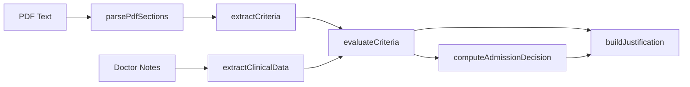

# Clinical Documentation Optimization System

<p align="left">
  <strong> 👩🏻‍💻 Chenyi Weng</strong><br/>
  Full-Stack Engineer · TypeScript · Clinical Rule Engine Architecture
</p>

---

A deterministic full-stack web system that aligns physician documentation with structured MCG M-282 Pneumonia Admission Criteria using a rule-based engine.

✅ Fully deterministic
✅ Clinically auditable


## 🌐 Live Deployment
Frontend (GitHub Pages)

https://mona100421.github.io/clinical-admission-alignment-engine/

Backend (Render)

https://clinical-alignment-backend.onrender.com

## Project Overview

This system implements a deterministic two-page clinical documentation optimization workflow aligned with MCG M-282 Pneumonia admission criteria.

The application:

1. Accepts raw physician documentation and an MCG guideline PDF.
2. Extracts structured clinical signals (e.g., hypoxemia, oxygen requirement, leukocytosis, comorbid risk).
3. Parses and maps guideline admission criteria into discrete evaluable rules.
4. Performs deterministic criteria matching using a rule-based engine.
5. Computes a transparent admission alignment score.
6. Generates structured revised documentation with medical necessity justification.
7. Optionally performs section-level validation against a reference output.

All outputs are reproducible, auditable, and traceable to explicit rule logic.

## Core Architecture

- Frontend: React + TypeScript + TailwindCSS + pdfjs-dist + GitHub Pages deployment
- Backend: Node.js + Express + TypeScript + Render + deployment Stateless rule engine
- Processing: Deterministic Rule Engine
- Data flow: Linear pipeline through discrete, stateless components

## Data Workflow


## Two-Page Workflow

#### Application Preview
🔹 Main Workflow
<p align="center">  </p>

🔹 Missing Criteria Evaluation
<p align="center">  </p>

🔹 Validation Mode
<p align="center">  </p>

🔹 Production Deployment
<p align="center">  </p>

### Page 1 – Input Interface
Required inputs:
- Doctor Raw Notes (text)
- MCG Guideline PDF (upload, PDF only)

Optional:
- Reference Revised Notes (enables validation mode)

Features include drag-and-drop PDF support, file validation, error handling, and step indicators for parsing guidelines, extracting clinical data, matching criteria, and generating output.

### Page 2 – Output Interface
Produces two structured outputs:
1) Revised Doctor Notes with sections: Clinical Summary, Medical Necessity Justification, Risk Stratification, Conclusion
2) Missing Criteria Table with columns: Criteria, Status (Met/Partially Met/Missing), Evidence Found, Suggested Language

## Deterministic Rule Engine

The engine processes inputs through six orchestrated components:
1) PDF Section Parser (`parsePdfSections`) parses PDF text into structured sections
2) Criteria Extractor (`extractCriteria`) identifies and categorizes admission criteria using keyword patterns
3) Clinical Data Extractor (`extractClinicalData`) parses physician notes into structured clinical signals
4) Criteria Evaluator (`evaluateCriteria`) matches criteria against clinical data using rule matrices
5) Admission Scorer (`computeAdmissionDecision`) calculates weighted scores and applies a 60% admission threshold
6) Justification Builder (`buildJustification`) generates structured revised documentation

The orchestration function `runAlignmentEngine` executes these steps sequentially and aggregates results into an `AlignmentResult` object.

## Validation Mode

When reference notes are provided (Case 1), the system performs structured section parsing and computes section-by-section similarity scores with word-level difference highlighting across Clinical Summary, Medical Necessity Justification, Risk Stratification, and Conclusion. An overall structured similarity percentage is displayed.

## Example Scenarios

### Case 1 – Validation Mode
Inputs: Doctor Raw Notes, MCG Guideline PDF, Reference Revised Notes
Outputs: Revised Doctor Notes, Missing Criteria Table, Structured Similarity Score

### Case 2 – Optimization Mode
Inputs: Doctor Raw Notes, MCG Guideline PDF
Outputs: Revised Doctor Notes, Missing Criteria Table, Admission Recommendation

## Getting Started

### Backend
```bash
cd server
npm install
npm run dev
# Server runs at http://localhost:5050
```

### Frontend
```bash
npm install
npm run dev
# Frontend runs at http://localhost:8081
```

## Project Structure

```
/
├── server/
│   ├── engine/
│   │   ├── alignmentEngine.ts
│   │   ├── criteriaExtractor.ts
│   │   ├── clinicalExtractor.ts
│   │   ├── criteriaEvaluator.ts
│   │   ├── admissionScorer.ts
│   │   └── justificationBuilder.ts
│   └── index.ts
├── src/
│   ├── components/
│   │   ├── InputPanel.tsx
│   │   ├── OutputPanel.tsx
│   │   ├── ValidationComparison.tsx
│   └── pages/
└── README.md

```

## Security & Design Philosophy

- No persistent storage; all processing is session-based
- Fully deterministic logic
- Stateless components with no side effects
- Auditability: every decision traces to specific rules
- Reproducibility: identical inputs produce identical outputs
- Clinical defensibility: results explained with precise logic

## Disclaimer

This tool assists clinical documentation and does not replace physician judgment.

